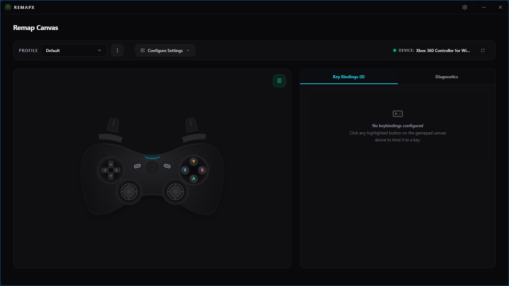

<p align="center">
  
</p>

<h1 align="center">RemapX</h1>

<p align="center">
  Desktop gamepad remapping built with <b>Tauri v2</b>, <b>Rust</b>, <b>React 19</b>, and <b>TypeScript</b>.
</p>

<p align="center">
  
</p>

## ✨ Features

- **Interactive Gamepad Visualizer**: Visual controller canvas that highlights pressed buttons and joystick movements in real-time.
- **Custom Bindings**: Map any controller button (D-Pad, face buttons, bumpers, triggers, and stick clicks) to keyboard outputs.
- **Process-Specific Profiles**: Assign configurations to specific executable files (e.g., target games). RemapX automatically detects the active foreground window and switches profiles dynamically.
- **Switch Chatter Filtering (Debounce)**: Prevent double-click behavior by adjusting the button debounce duration (in milliseconds).
- **Joystick Deadzone Calibration**: Fine-tune inner circular deadzones to prevent stick drift on worn controllers.
- **Smart Focus Blocking**: RemapX detects when its own window is focused and temporarily pauses keyboard injection to avoid keypress loops or interference during configuration.
- **Real-Time Log / Diagnostics View**: Track button events, active process queries, and key injection events through a clean, modern diagnostics console (with optional verbose Developer Mode logs).
- **Multi-Language Support**: Complete localization support for **English** and **Indonesian** out of the box.

## 🗺️ Roadmap

- [x] Keyboard button remapping
- [x] Process-specific profiles
- [x] Debounce and deadzone tuning
- [x] Diagnostics view and developer mode
- [x] Tray behavior
- [x] Start minimized support
- [x] Portable build detection
- [ ] Mouse and system-action mappings
- [ ] Macro recording and playback
- [ ] Profile import/export
- [ ] Mapping validation and conflict warnings
- [ ] Better active-profile visibility and onboarding

And more...

## 🛠️ Technology Stack

### Frontend
- **Framework**: [React 19](https://react.dev/) + [Vite](https://vite.dev/)
- **Language**: [TypeScript](https://www.typescriptlang.org/)
- **Styling**: [Tailwind CSS](https://tailwindcss.com/) + [Framer Motion](https://www.framer.com/motion/) for animations
- **State Management**: [Zustand](https://github.com/pmndrs/zustand)
- **Localization**: [i18next](https://www.i18next.com/) & [react-i18next](https://react.i18next.com/)

### Backend
- **Framework**: [Tauri v2](https://v2.tauri.app/) (Desktop runtime)
- **Language**: [Rust](https://www.rust-lang.org/)
- **Database**: SQLite
- **OS APIs**: Windows-sys integration for process tracking and hardware-level keyboard input simulation.

## 🚀 Getting Started

### Prerequisites

Ensure you have the following installed on your machine:
1. **Node.js** (v18 or higher)
2. **Rust** toolchain (installed via [rustup](https://rustup.rs/))
3. **Bun** package manager (`npm install -g bun`)
4. Build tools for Windows (e.g., Visual Studio C++ Build Tools)

### Installation

Clone the repository and install the dependencies:

```bash
# Clone the repository
git clone https://github.com/KidiXDev/RemapX.git
cd RemapX

# Install npm/bun dependencies
bun install
```

### Run in Development Mode

Run the app in hot-reloading development mode:

```bash
bun run tauri dev
```

### Build for Production

Compile and bundle the desktop application for production:

```bash
bun run tauri build
```

## 📄 License

This project is licensed under the MIT License. See the [LICENSE](LICENSE) file for details.
